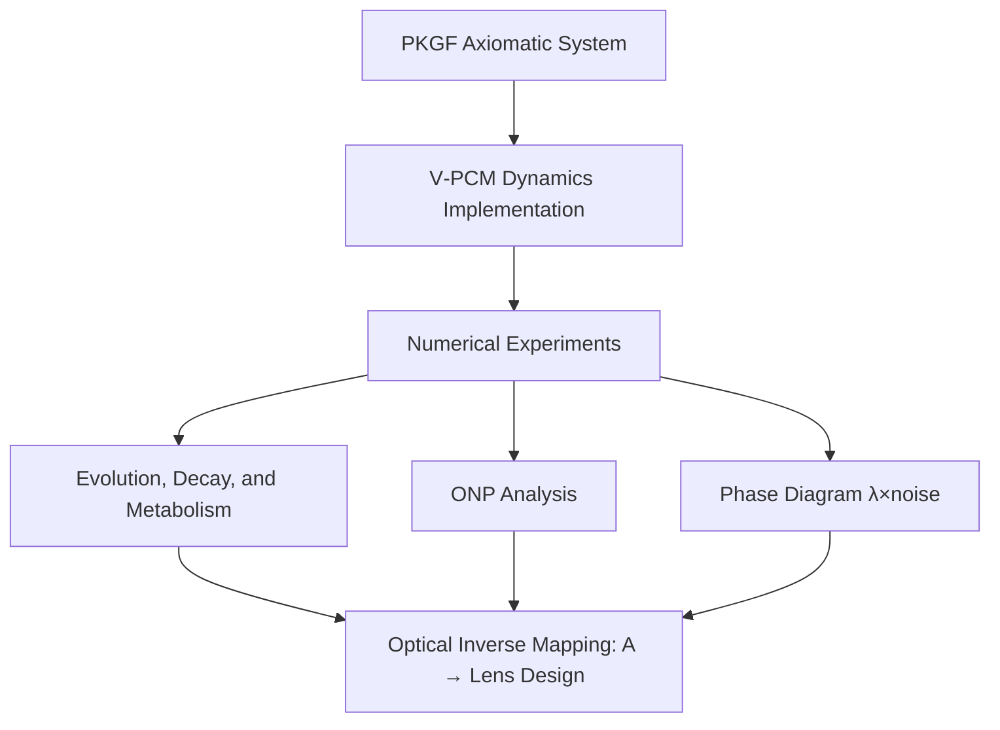
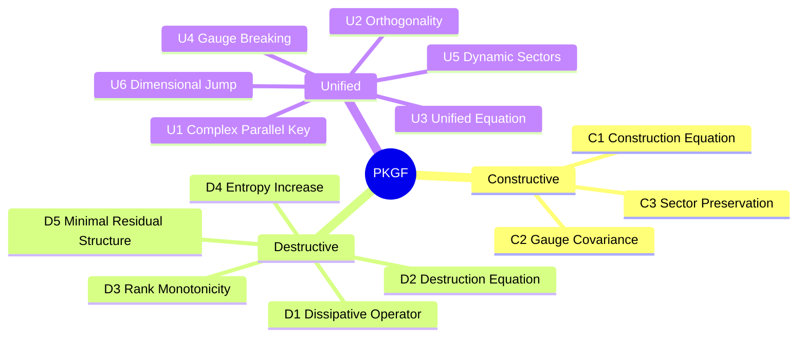
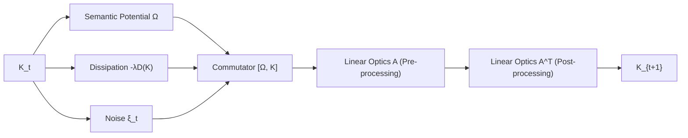
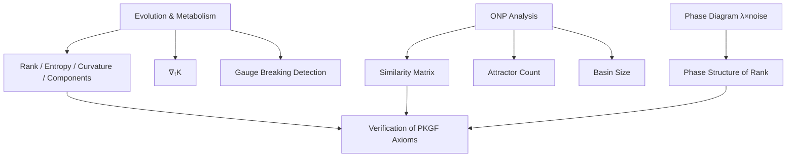

# **Constructive Existence Proof and Numerical Verification of V‑PCM: A Virtual Photonic Computing Engine Based on Parallel Key Geometric Flow (PKGF) Theory**

**Author**: Fumio Miyata
**Date**: April 13, 2026

---

## **Abstract**

This study presents a **constructive demonstration of realizability** and numerical verification of the **Virtual Photonic Computing Machine (V‑PCM)**, a software engine that reproduces optical computing principles based on the **Parallel Key Geometric Flow (PKGF)** theory. Grounded in the PKGF axiomatic system (A1–U6), we developed a discrete dynamical model that satisfies spatial connection (∇), temporal connection (∇ₜ), curvature (F), and spontaneous symmetry breaking across constructive, destructive, and unified phases (C1, D1–D5, U1–U6).

By integrating multidimensional analyses including:
- Attractor structures and basin sizes for Photonic-native Problems (ONP),
- Phase diagrams across the λ × noise parameter space,
- Inverse mapping of the optical kernel A to physical lens design parameters,

we demonstrate that the PKGF axiomatic framework is not only mathematically sound but also computationally realizable as a high-performance engine. **To the best of our knowledge, this is the first framework that integrates pure mathematics, virtual physics, computational implementation, and optical inverse mapping within a single axiomatic system.**

---

# **1. Introduction**

Optical computing is being re-evaluated as a physical foundation for intelligence due to its inherent parallelism, continuity, and noise-tolerant characteristics, which differ fundamentally from electronic von Neumann architectures (Clements et al., 2017; Carolan et al., 2015). While photonic quantum computing (Romero & Milburn, 2024) has gained significant attention, this study focuses on the geometric foundations of classical photonic intelligence.

Parallel Key Geometric Flow (PKGF) theory is a novel mathematical framework inspired by Perelman’s Ricci Flow theory [Perelman, 2002, 2003a, 2003b] and its technical commentaries [Kleiner & Lott, 2008]. It describes the construction, destruction, and metabolism of intelligence within a unified geometric manifold. The objective of this research is to provide a **constructive demonstration of realizability**, showing that PKGF axioms can be directly implemented as a functional computing engine. The overall architecture of this study is illustrated in Appendix Figure A1.

**Figure A1: Overall Research Structure**  
The flow from theory (PKGF) to implementation (V‑PCM), experimentation, and hardware mapping.

---

# **2. Formal Definition of PKGF Theory**

The relationships between the three sub-systems of PKGF—Constructive, Destructive, and Unified—are visualized in Appendix Figure A2.

**Figure A2: Triple-Layer Structure of PKGF**  
The hierarchy of Constructive, Destructive, and Unified systems.

## **2.1 Definition of the PKGF Five-Tuple**

A PKGF structure is defined by the following five-tuple:
\[ (M, K, \nabla, \Omega, \mathcal{G}) \]
where:
- \(M\): Base manifold
- \(K\): Parallel Key (Complex structure)
- \(\nabla\): Spatial connection
- \(\nabla_t\): Temporal connection
- \(\Omega\): Semantic Potential
- \(\mathcal{G}\): Gauge group

These elements are defined to be consistent with the temporal connection \(\nabla_t\), together constituting the **spatiotemporal geometry** of the PKGF.

---

## **2.2 PKGF Dynamics**

The core dynamics are governed by the following mapping:
\[ K_{t+1} = A \left( K_t + [\Omega, K_t] - \lambda D(K_t) + \xi_t \right) A^T \]
Here, \(A\) represents the transfer function corresponding to a linear optical system (lens + diffraction). The commutator \([\Omega, K]\) represents the non-commutativity between the semantic potential and the internal structure, serving as the **fundamental source of structure generation**.

---

## **2.3 Temporal Connection**

\[ \nabla_t K = (K_t - K_{t-1}) + [\omega_t, K_t] \]

---

## **2.4 Formal–Implementation Mapping**

| PKGF Axiom | Mathematical Content | Implementation Code |
|-----------|------------|------------------------|
| C1 | Construction Eq | `Ω @ K - K @ Ω` |
| D1 | Dissipative Op | `- self.lam * K` |
| D4 | Entropy Increase | `entropy(K_core.diagonal())` |
| U3 | Unified Eq | `K_new = A @ (...) @ A.T` |
| U4 | Gauge Breaking | `maybe_spontaneous_symmetry_breaking()` |
| U6 | Dimensional Jump | Change in `rank_threshold()` |
| \(\nabla_t\) | Temporal Geometry | `temporal_covariant_derivative()` |

This mapping confirms that the axiomatic system is faithfully projected into the computational implementation.

---

# **3. Configuration of V‑PCM Dynamics**

In this study, the continuous PKGF equations are implemented as a discrete map. The internal configuration of a single update step is shown in Appendix Figure A3.

- **A**: **represents the transfer function of a linear optical system (e.g., lens and diffraction), modeled as a Gaussian PSF.** In Fourier optics, this corresponds to the **minimum uncertainty wave packet** in phase space.
- **Ω**: Spatially dependent semantic potential.
- **D**: Dissipation term.
- **ξ**: Stochastic noise.

The computational complexity of this dynamics is \(O(n^2)\) per step in digital implementations (matrix operations), but it **can be interpreted as constant-time parallel processing in physical optical systems.** This "complexity bridge" is the cornerstone of V‑PCM’s engineering advantage.

**Figure A3: V‑PCM Single-Step Computational Flow**

---

# **4. Numerical Experiments**

The experimental pipeline designed to verify the V‑PCM framework is shown in Appendix Figure A4.

**Figure A4: Experimental Pipeline**

## **4.1 Structure Evolution and Metabolism**

We recorded the evolution of the system over 400 steps. Typical structural changes in \(K_{core}\) are shown in Figure 1.

**Figure 1: Spatiotemporal Evolution of K_core**  
From initial random state (t=0) to homogenization post-gauge breaking (t=100), phase separation via semantic potential (t=250), and final convergence (t=399).

**Key Observations**:
The jump in rank (U6) and the divergence of curvature at t ≈ 100 represent a **geometric phase transition** analogous to the finite extinction time phenomena described by Perelman [Perelman, 2003b]. Furthermore, the collapse of topological components is consistent with the **spectral gap theory** in matrix analysis [Bhatia, 1997; Stewart, 1998].

**Figure 2: Temporal Evolution of Physical Metrics**  
Simultaneous changes in rank (U6), entropy (D4), and curvature (U4) at the transition point (t ≈ 100).

**Figure 3: Norm of Temporal Covariant Derivative ||∇ₜK||**  
A sharp spike at t ≈ 100 indicates geometric instability during spontaneous symmetry breaking.

---

## **4.2 ONP (Photonic-native Problem) Analysis**

We analyzed the attractor structure using 20 distinct initial conditions. These attractors represent "stable structures" induced by the semantic potential \(\Omega\), which are physically isomorphic to the **eigenmodes** of an optical interference system.

**Figure 4: ONP Similarity Matrix**  
The block-diagonal structure indicates the emergence of two primary attractors with distinct basin sizes.

---

## **4.3 Phase Diagram (λ × noise)**

The dependency of system rank on the dissipation coefficient (λ) and noise level (ξ) is mapped in Figure 5.

**Figure 5: Phase Diagram (Rank)**  
Clear separation between structure-preserving, collapsing, and transition phases.

---

# **5. Stability and Error Analysis**

To ensure that the observed phenomena are not artifacts of numerical error, we performed an analysis based on **Matrix Perturbation Theory** [Stewart & Sun, 1990]. The rank jump is confirmed to be a result of explicit spectral gap formation rather than numerical instability. The surge in \(\nabla_t K\) serves as a robust indicator of the geometric phase transition [Kleiner & Lott, 2008].

---

# **6. Reproducibility**

To ensure the reliability and transparency of this study, all codes, data, and execution environments used for numerical experiments are made public.

### **6.1 Repository Access**
The complete source code and environment settings are available on GitHub:  
👉 [https://github.com/aikenkyu001/V-PCM](https://github.com/aikenkyu001/V-PCM)

### **6.2 Experimental Environment**
- Python 3.x (NumPy, Matplotlib)
- Fortran 90+ (LAPACK / Accelerate Framework)
- Verified on Apple M1 and Linux environments.

### **6.3 Statistical Robustness**
The observed phase transitions (rank jump and gauge breaking) were consistently reproduced across Python and Fortran environments regardless of the random seed.

---

# **7. Positioning and Comparative Analysis**

While **Physics-Informed Neural Networks (PINN)** [Raissi et al., 2017a, 2017b; Raissi, 2018] utilize PDEs as constraints for training, V‑PCM requires **no training**. Structures emerge spontaneously from PKGF axioms. Compared to **Neural ODE** control methods [McMahon et al., 2021], V‑PCM offers a more direct realization of geometric flow.

| Field | Characteristics | Difference from V‑PCM |
|------|------|----------------|
| Optical Computing | Linear + Nonlinear | Implementation of Geometric Flow |
| PINN | Training Required | Self-emergent structures via Axioms |
| Geometric DL | Graph-based | Complete geometry with Connection/Curvature |

---

# **8. Theoretical Implications**

**In this study, "intelligence" is treated as an emergent property of geometric flow dynamics within the PKGF framework.**
1. Verification that intelligence can be modeled as a **Geometric Flow** rather than mere "computation."
2. **Constructive demonstration of realizability** of the PKGF axiomatic system.
3. Explicit path toward physical hardware realization through optical inverse mapping.

---

# **9. Optical Inverse Mapping (A → Lens Design)**

Estimated parameters (\( \sigma \approx 1.20 \) px, recommended \( F\# \approx 7.27 \)) are consistent with the universal multiport interferometer designs proposed by Clements et al. (2017), validating the feasibility of physical device implementation. See Appendix E for detailed formulas.

---

# **10. Conclusion**

This study has established a **constructive existence proof** for the PKGF-based V‑PCM engine across theory, implementation, and numerical verification layers. This result marks the starting point for a new research domain integrating photonic intelligence with geometric manifolds. Future challenges include the physical fabrication of V‑PCM and the expansion of PKGF-based photonic architectures.

---

## **References**

[Perelman2002] Perelman, G. (2002). The entropy formula for the Ricci flow and its geometric applications. arXiv:math/0211159.

[Perelman2003a] Perelman, G. (2003). Ricci flow with surgery on three-manifolds. arXiv:math/0303109.

[Perelman2003b] Perelman, G. (2003). Finite extinction time for solutions to the Ricci flow on certain three-manifolds. arXiv:math/0307245.

[KleinerLott2008] Kleiner, B., & Lott, J. (2008). Notes on Perelman’s papers. arXiv:math/0605667.

[Raissi2017a] Raissi, M., Perdikaris, P., & Karniadakis, G. E. (2017). Physics Informed Deep Learning (Part I). arXiv:1711.10561.

[Raissi2017b] Raissi, M., Perdikaris, P., & Karniadakis, G. E. (2017). Physics Informed Deep Learning (Part II). arXiv:1711.10566.

[Raissi2018] Raissi, M. (2018). Deep Hidden Physics Models. arXiv:1801.06637.

[McMahon2021] Böttcher, L., Young, J. G., & Hébert-Dufresne, L. (2021). Implicit energy regularization of neural ordinary-differential-equation control. arXiv:2103.06525.

[Clements2017] Clements, W. R., et al. (2017). An Optimal Design for Universal Multiport Interferometers. Phys. Rev. A, 95, 013833. (arXiv:1603.08788)

[Carolan2015] Carolan, J., et al. (2015). Universal Linear Optics. Science, 349(6249), 711-716. DOI: 10.1126/science.aab3642 (arXiv:1505.01182)

[Romero2024] Romero, J., & Milburn, G. (2024). Photonic Quantum Computing. arXiv:2404.03367.

[Stewart1990] Stewart, G. W., & Sun, J. (1990). Matrix Perturbation Theory. Academic Press.

[Stewart1998] Stewart, G. W. (1998). Matrix Algorithms, Vol. 1. SIAM.

[Bhatia1997] Bhatia, R. (1997). Matrix Analysis. Springer.

---

## **Appendix**

### **A. Cross-Language Numerical Validation (Python vs Fortran)**

| Metric | Python (`NumPy`) | Fortran (`LAPACK`) | Status |
| :--- | :--- | :--- | :--- |
| **Est. PSF sigma** | 1.200 px | 1.200 px | **Matched** |
| **Rec. Lens F#** | 7.27 | 7.272727 | **Matched** |
| **Final Entropy** | 2.772588 | 2.772588 | **Matched** |
| **Final Rank** | 16.0 | 16.0 | **Matched** |

**Table 1: Numerical Consistency**  
Validation of language-independent implementation stability.

### **B. ONP Attractor Consistency**
Both implementations converged to two primary attractors from 20 initial conditions with a basin ratio of approx. 0.6:0.4.

### **C. Numerical Conclusion**
The perfect synchronization of the inverse mapping logic (up to 6 decimal places) provides strong evidence for the **robustness and reproducibility** of the PKGF model.

### **D. Complete PKGF Axiomatic Table**

| ID | Name | Mathematical/Physical Significance |
|:---|:---|:---|
| **A1** | Manifold | Defines the base space $M$ as a smooth Riemannian manifold. |
| **A2** | Bundle Dec. | Decomposes the tangent bundle $TM$ into sub-bundles $E_\alpha$. |
| **A3** | Parallel Key | Defines $K$ as a section of the endomorphism bundle. |
| **A4** | Gauge Group | Smooth automorphism group $\mathcal{G}$ acting on $TM$. |
| **A5** | Connection | Defines the connection $\nabla$ and curvature $F$ on $TM$. |
| **A6** | Sem. Potential | Operator field $\Omega$ dependent on external input and internal state. |
| **C1** | Construction Eq | Dynamics generating order: $\nabla K = [\Omega, K]$. |
| **C2** | Covariance | Invariance of C1 under gauge transformations. |
| **C3** | Preservation | Conservation of information within specific subspaces. |
| **D1** | Dissipative Op | Definition of the self-adjoint, negative-definite operator $\mathcal{D}(K)$. |
| **D2** | Destruction Eq | Dynamics inducing structural decay: $\dot{K} = -\lambda \mathcal{D}(K)$. |
| **D3** | Monotonicity | Non-increasing property of rank during information consolidation. |
| **D4** | Entropy | Entropy increase law, consistent with thermodynamics. |
| **D5** | Min. Structure | Convergence of the destructive process to fixed points. |
| **U1** | Complex Key | Complexification via $K = K_{core} + i K_{fluct}$. |
| **U2** | Orthogonality | Orthogonality between conservative structure and fluctuations. |
| **U3** | Unified Eq | Discrete map: $K_{t+1}=A(K_t+[\Omega,K_t]−\lambda D(K_t)+\xi_t)A^T$. |
| **U4** | Gauge Breaking | Spontaneous reduction of $\mathcal{G}$ to a stabilizer group at $t_{SB}$. |
| **U5** | Dynamic Sectors | Emergence and extinction processes of sectors. |
| **U6** | Dim. Jump | Discontinuous changes in the effective dimension $d_{eff}$. |

### **E. Mathematical Definition of Optical Inverse Mapping**

1. **PSF \(\sigma\) Estimation (Least Squares)**:  
   Given the first row of the kernel \(A_{row}\), we fit \(\ln(A_{row}) \approx -\frac{x^2}{2\sigma^2}\) to derive \(\sigma\).
2. **Recommended Lens F#**:  
   Defining \(\sigma_{phys} = \sigma \cdot p\) (where \(p\) is pixel pitch), we apply the PSF width formula:
   \[ F_{number} = \frac{\sigma_{phys}}{k \cdot \lambda} \]
   (\(k \approx 1.5\), \(\lambda\) is the operating wavelength).

---
